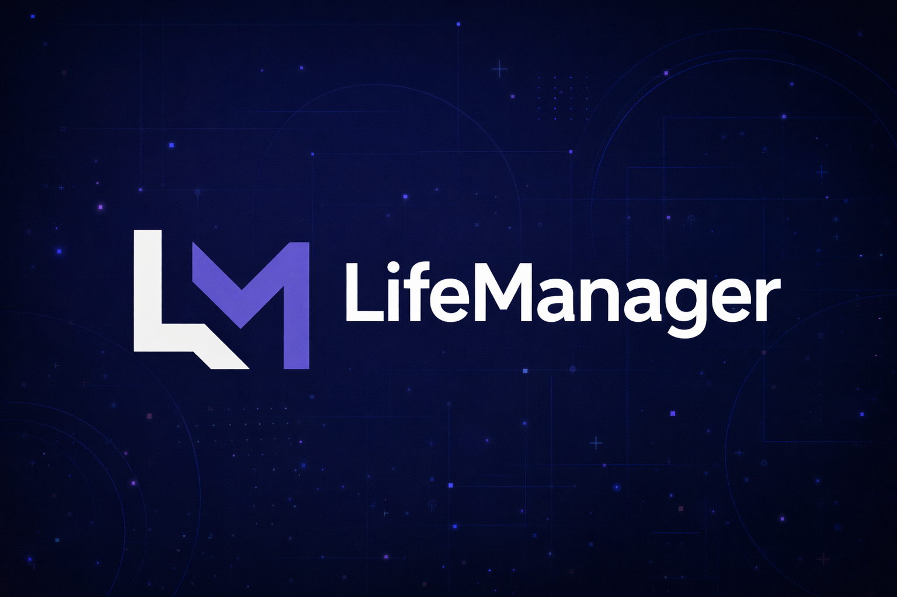

  

  
  
  
  
  
  
  
  

https://github.com/iuricode/readme-template/tree/main/avancado

> [!NOTE]  
> **Life Manager** is an all-in-one personal management app designed to help users organize and track the most important areas of their life: **Finances, Nutrition, and Training**.

## 🎯 Project Purpose

> [!WARNING]
> Life Manager was developed as a learning-focused portfolio project with the goal of consolidating and expanding practical knowledge in full-stack development.

### The project was specifically used to:
- Learn React and modern frontend development from scratch
- Learn UI responsiveness and CSS properties (TailwindCSS)
- Learn Spring Boot and backend application structure
- Understand and apply authentication concepts
- Practice the use of DTOs, service layers, and clean application structure
- Solidify core concepts such as separation of concerns and maintainability

## 🚀 Features

### 🥗 Nutrition Management
- Track meals and nutritional data
- Organize daily and weekly intake

### 🏋️ Training Management
- Manage workouts and training routines
- Track progress over time

### 💰 Finance Management
- Record expenses and income
- Categorize financial activity

## 🏗️ Architecture Overview
- **Frontend:** Single Page Application built with React and TypeScript
- **Backend:** RESTful API developed with Spring Boot
- **Authentication:** JWT with access and refresh tokens
- **Database:** PostgreSQL with schema versioning via Flyway
- **Caching:** Redis integrated using Spring Cache abstraction
- **Infrastructure:** Docker for local development

## Getting Started